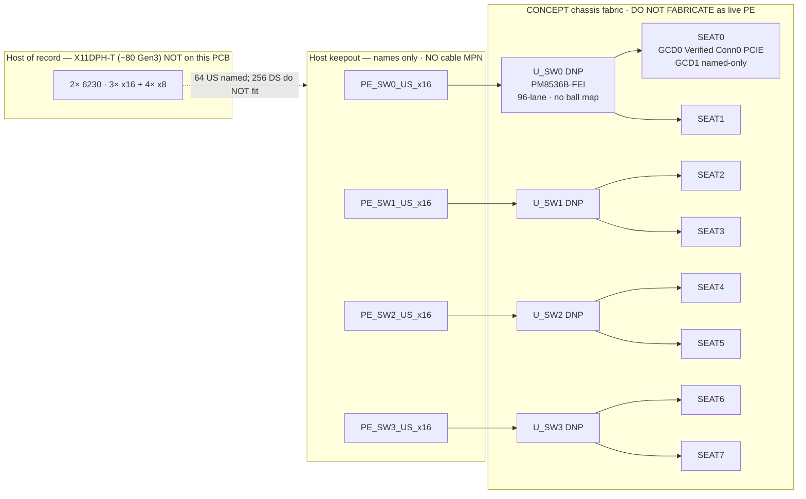
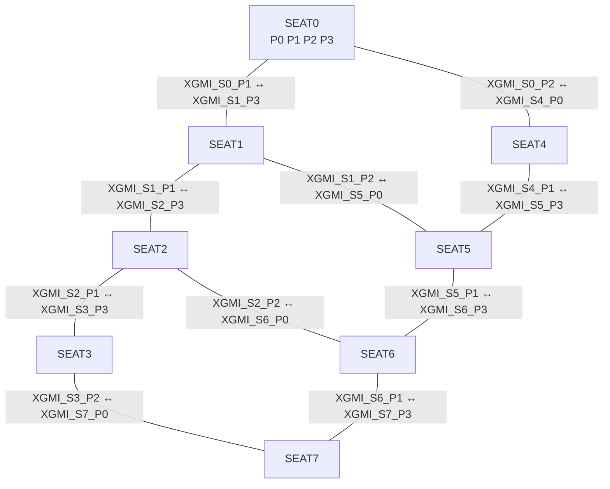

# CONCEPT — 8× MI250X full-width chassis fabric

**CONCEPT / IDEAS ONLY. DO NOT FABRICATE. DO NOT ENERGIZE P48V.**  
**Not a motherboard. Not a PCBWay zip. Not a live PE design.**

This folder is an architecture sketch Eli can build later spins on. It sits beside the Rev3 8-seat board (`Generated_Project/Rev3_8Seat_PCBWay_Chassis_v1/`). First-article populate remains **seats 0–1, GCD0 x16 only**. The 8-wide names and four PM8536 DNP courtyards already on that board are the physical hooks for this CONCEPT — they are **not** routed, stuffed, or claimed DRC-clean as live PE.

Do **not** invent: AMD overlay pad numbers, PM8536 ball maps, CEM/MCIO pinouts, OAM r2.0 maps, S1–S7 assignments, TEST\*/RFU/DO_NOT_USE nets, or a host-cable MPN.

Labels: **Verified** (public doc / this repo’s pinmap CSVs) · **Hypothesis** (Eli invited; not a pin assignment) · **Missing** (blocks a later spin).

---

## What this CONCEPT is

Chassis **fabric** for eight OAM v1.x seats: 16 named x16 PE buses, four DNP switch courtyards, named host uplinks, and an xGMI mesh drawn as **boxes and port names only**.

Host of record stays SuperMicro **X11DPH-T** (~80 Gen3 lanes). **This CONCEPT cannot light 8× full-width on that host.** Do not design a new CPU board here.

## What this CONCEPT is not

- A fab package (Gerbers in `Rev3_8Seat_PCBWay_Chassis_v1/fab/` are POWER+MECH first article).
- A legal GCD1 pad map, xGMI pad map, or switch pinout.
- A claim that X11DPH-T can drive 256 downstream lanes.

---

## Public fact vs hypothesis vs missing

| Item | Class | Notes |
|---|---|---|
| 8 OAM v1.x seats, KOZ **103×166 mm**, 4×2 → floor **412×332 mm** on outline **492×372 mm** | **Verified** mech (KOZ/Fig 14); 4×2 tiling **Inferred** | Molex **218910-1115** ×16. P3V3 = Conn0 **C1/C2** only. **r2.0 unused.** |
| Conn0 `PCIE_TX/RX0–15` P/N = 64 pads, lanes 0–15 | **Verified** OCP host link | Architectural name `PE_Sn_GCD0_x16`. Pin list: PETp/n + PERp/n [15:0], Conn0, Required. |
| Conn1 `PCIE_*` | **Verified** **0** pads | GCD1 is **not** an OCP `PCIE_*` name. |
| `PE_Sn_GCD1_x16` (8 names) | **Hypothesis** name only | Overlay **Unknown**. **Do not assign S1–S7.** Conn1 `S7_*` = SERDES_7 reserved, **no net**. |
| 16 named x16 PE = “full width” | **Hypothesis** architecture | 8×2 GCD × x16. Dual-GCD is a public MI250X fact; the pad split is not. |
| PM8536B-FEI ×4, 96-lane Gen3, 1311-ball 37.5 mm 1.0 mm | **Verified** Microchip PFX package table | Courtyards **already on the Rev3 board**, **DNP**. **Ball map Missing.** |
| Each SW: 2 seats × 2 GCD × x16 DS + one x16 US (64 DS + 16 US) | **Hypothesis** partition | 80 of 96 lanes; 16 spare/SW. **Not a pinout.** |
| 256 DS + 64 US vs 4×96 = 384 | **Verified** arithmetic | Lane counts only. No balls, no routing. |
| X11DPH-T 3× x16 + 4× x8 ≈ **80** Gen3 | **Verified** SuperMicro | 4× US x16 = 64 **fit as a host uplink budget**. **256 DS do not.** CONCEPT **cannot light 8 full-width** on this host. |
| xGMI / Infinity Fabric mesh (`XGMI_Sn_P0`…) | **Hypothesis** boxes + port names | **Not** mapped to S1–S7. S1–S7 stay **no net**. |
| P48V SB175 star + per-seat `0476015.MR` | **Verified** on Rev3 copper | 240 V / 50 A **single-phase** → off-board **DPU-3200-48 class**. **Not** RST-5000-48 (3-phase). **DO NOT ENERGIZE.** |
| Host attach keepout + `PE_SWk_US_x16` names | **Hypothesis** names | **No** CEM/MCIO/SlimSAS MPN. Keepout only. |
| AMD 688-pad overlay | **Missing** | Blocks GCD1, xGMI, live PE. |
| PM8536 ball map | **Missing** | Blocks stuffing SW0–SW3. |
| Host plug + cable | **Missing** | Blocks lighting even named US links. |
| Molex 1.2 A/contact at 48–59.5 V (2 oz) | **Missing** (ticket 167157) | Blocks energize. |
| GPU cooling / cold plate | **Missing** | Not on this PCB. Do not shop onto the chassis BOM. |

---

## Seat grid (same PCB)

```
Y=20   SEAT0  SEAT1  SEAT2  SEAT3     |  SW0  SW1     host keepout
Y=186  SEAT4  SEAT5  SEAT6  SEAT7     |  SW2  SW3     (no cable MPN)
south: SB175 star + F0..F7           |  12V brick south of SW3
```

Populate on the **same copper**: seats **0–1** (first article, no stuffed switch) → **0–3** → all **8** + SW0–SW3. First article still cannot run live GPUs.

---

## PE fabric (named buses only)

**Verified** GCD0 pads: `OAM{n}_PCIE_*` = Conn0 OCP `PCIE_*`.  
**Hypothesis** names (not pad maps): `PE_Sn_GCD0_x16`, `PE_Sn_GCD1_x16`, `PE_SWk_US_x16`.

```
SW0 = seats 0,1    SW1 = seats 2,3    SW2 = seats 4,5    SW3 = seats 6,7
each:  PE_Sa_GCD0_x16 + PE_Sa_GCD1_x16 + PE_Sb_GCD0_x16 + PE_Sb_GCD1_x16  →  64 DS
       PE_SWk_US_x16  →  host keepout                                     →  16 US
```

```
8 × 2 × x16 = 256 DS
4 × x16 US  =  64 US
need 320 switch ports; 4 × 96 = 384  → 64 spare (hypothesis load)
```

Host **X11DPH-T ~80** can **name** 4× x16 US (64). It **cannot** present 256 host lanes. Switch concentration / oversubscription is an idea, not a working system. **Do not claim DRC-clean live PE.** PE / REFCLK / PERST# stay unrouted.

---

## Block diagram



---

## xGMI / Infinity Fabric — boxes and port names only

**Hypothesis.** These names are chassis-side idea labels (`XGMI_Sn_P0` …). They are **not** OCP pin names, **not** AMD overlay pads, and **must not** be tied to S1–S7 / TEST\* / RFU / DO_NOT_USE.

Legend (hypothesis): **P0** north · **P1** east · **P2** south · **P3** west. Edge ports that have no neighbour stay unused in the sketch.

### 4-OAM mesh (physical 2×2: seats 0, 1, 4, 5)

```
        XGMI_S0_P1 <----> XGMI_S1_P3
  SEAT0                    SEAT1
        XGMI_S0_P2          XGMI_S1_P2
           ^                   ^
           |                   |
           v                   v
        XGMI_S4_P0          XGMI_S5_P0
  SEAT4                    SEAT5
        XGMI_S4_P1 <----> XGMI_S5_P3
```

### 8-OAM mesh (4×2, all seats)



On-module GCD0↔GCD1 Infinity Fabric is a public dual-GCD fact and lives **on the module**, not as a chassis net.

---

## 48 V

Existing Rev3 path: Anderson **6325G1** + 2× **1382** (SB175) → star + Kelvin → per-seat **0476015.MR** 15 A → local Conn0 pours. **Not** a 100 A flood. **Not** Dell D3000E-S1 (12 V CRPS).

Wall: **240 V / 50 A single-phase** → off-board **DPU-3200-48 class**. **Do not specify RST-5000-48** (3-phase). Off-board PSU is **not** a PCB BOM item.

**DO NOT ENERGIZE** until Molex 1.2 A/contact at 48–59.5 V (2 oz) is written.

---

## Host attach

Keepout on the 40 mm strip + four named US links (`PE_SW0_US_x16` … `PE_SW3_US_x16`). First-article silk still calls **two** GCD0 x16 (`PE_S0_GCD0_x16` + `PE_S1_GCD0_x16`) because that is the only legal named host PE **today**.

No invented cable MPN. No CEM / SlimSAS / MCIO pinout. SuperMicro CBL-MCIO is a UBB cable, not this host.

---

## Later-spin checklist (do not do in this CONCEPT)

1. AMD overlay (GCD0 confirm, GCD1 pads, xGMI vs S1–S7 — or leave S1–S7 unmapped).
2. Public/legal PM8536 ball map, then escape (finer than 6/6 mil; requote).
3. Host plug with a **cited** datasheet; still do not invent OAM↔cable maps.
4. Molex 1.2 A/contact write-up, then reconsider energize.
5. Cooling — off this PCB.
6. A host that can actually light 256 DS if the goal is 8× full-width **host-equivalent** PE. X11DPH-T is not that host. This folder does **not** design that board.

See **[LATE_BIND.md](LATE_BIND.md)**: what is reserved vs what a later spin must add. **16× x16 PE + four 1311-ball escapes = respin, not a silk ECO.** Do not claim the POWER+MECH zip works as a live GPU chassis if sent to PCBWay.

---

## Can / cannot (this CONCEPT)

**Can (ideas / names / mech already on Rev3):**

- Sit 8 modules (KOZ, Molex, NPTH) on the existing 8-seat PCB.
- Name 16× x16 PE buses and 4× US x16 toward the keepout.
- Cite Conn0 OCP `PCIE_*` as GCD0 on every seat.
- Keep four PM8536 DNP courtyards as the public-MPN switch idea (384 vs 320 lane arithmetic).
- Draw xGMI as boxes and `XGMI_Sn_P*` names.
- Keep P48V star + per-seat fuses; 2→4→8 populate.

**Cannot:**

- Light **8× full-width** on X11DPH-T (~80 vs 256 DS).
- Map GCD1 pins, xGMI ports, or switch balls.
- Assign S1–S7 or TEST\*/RFU/DO_NOT_USE.
- Route or DRC-clean live PE.
- Invent CEM/MCIO/r2.0.
- Energize P48V or upload this CONCEPT to PCBWay as a live 8-wide.

**DO NOT FABRICATE this CONCEPT as live PE. DO NOT ENERGIZE P48V.**
