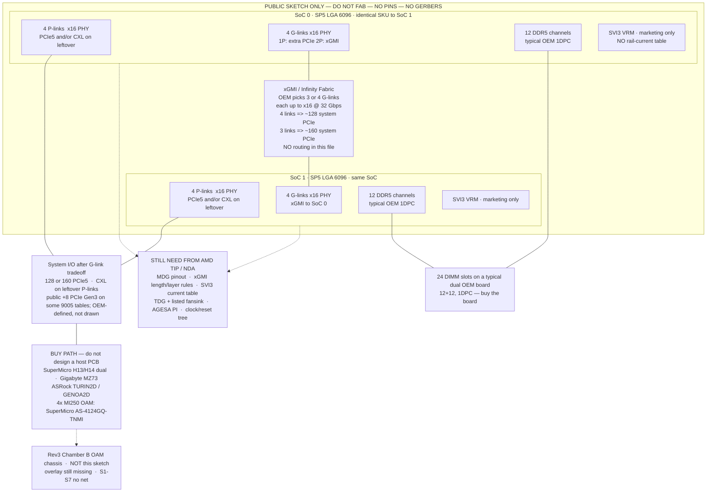

# PUBLIC-FACTS SKETCH — dual-socket (2P) AMD EPYC on SP5

**THIS IS NOT A MOTHERBOARD.**  
**DO NOT FABRICATE. DO NOT GERBER. DO NOT INVENT PINS.**  
**DO NOT SEND THIS TO PCBWAY. DO NOT PLACE AN SP5 FOOTPRINT FROM THIS FILE.**

Date: 2026-08-22  
Tree: `Generated_Project/Rev3_8Seat_PCBWay_Chassis_v1/docs/`  
Status: **architecture sketch from public documents only.** Not a schematic, not a layout, not a pinout, not a VRM design, not firmware you can flash.

Labels used here:

| Label | Meaning |
|---|---|
| **Verified** | A public AMD / OEM / tianocore / vendor-marketing sentence that was retrieved for this sketch |
| **Inferred** | Arithmetic or reading of those sentences (lane budgets, 1DPC = 24 DIMMs on a dual board). **Not** a pin assignment |
| **Unknown / NDA** | Lives behind AMD TIP, AGESA PI, TDG/MDG, or the MI250X overlay. **Stop.** |

If a reader could take this file to a fab house, the file has failed. Its job is the opposite.

Rev3 Chamber B remains an **OAM chassis PCB**. Host of record on that zip is still SuperMicro **X11DPH-T**. This sketch does **not** replace that host, does **not** swap Xeon for EPYC on the chassis copper, and does **not** authorize a new CPU board in this repo.

---

## 1. What a 2P EPYC system is (public)

A 2P EPYC machine is **two identical SoCs** in **SP5 (LGA 6096)** sockets, talking to each other over **xGMI / Infinity Fabric G-links**. AMD server EPYC in this generation is **1P or 2P only**. There is no public 4P/8P glue the way some Xeon platforms have UPI meshes.

Public I/O die picture (Genoa/Turin on SP5):

- **4 P-links + 4 G-links**, each a **x16** high-speed group. **128 PCIe Gen5 lanes per socket** before any G-link is spent on the other CPU.
- In **1P**, G-links can be PCIe as well → **128** system PCIe Gen5.
- In **2P**, an OEM picks **3 or 4** G-links between the two SoCs. Each G-link uses **up to 16 PCIe lanes** of the same PHY, at **up to 32 Gbps** (AMD: “32 Gb/s x16 PCIe speeds”).
  - **4 G-links** → 64 lanes/socket consumed by xGMI → **64 PCIe left per socket** → **~128 system PCIe**.
  - **3 G-links** → 48 lanes/socket consumed → **80 PCIe left per socket** → **~160 system PCIe**.
- Leftover **P-links** stay PCIe Gen5 and/or **CXL** (9004: CXL 1.1+; 9005: CXL 2.0, public max **64 lanes / 4 P-links**). That is a **function of unused P-links**, not a pin map.
- **12 DDR5 channels per socket** (24 in 2P). Public OEM dual boards are typically **1DPC** (24 DIMM slots). AMD also documents 2DPC for capacity; that is a different stuffing, not a different SoC.
- Socket name **SP5**, contact count **6096**. Package crumb **~72 × 75.4 mm**. Socket-housing crumbs in vendor marketing are in the **~80 mm** class (Foxconn/Lotes; see §1.4). **No public pin names are used in this file.**
- **cTDP** publicly spans about **120–500 W/socket** on 9005 (many 9004 SKUs top out near **400 W**; some 9005 SKUs list **500 W**). Official **Thermal Design Guide (TDG)** and **Mechanical Design Guide (MDG)** are **NDA / AMD TIP**. Cooling is **not** “pick a tower cooler.” Buy a **listed OEM 2P fansink** for that board.
- CPU VRM protocol in public silicon-vendor pages is **AMD SVI3**. That is **marketing** (Renesas, Infineon). There is **no public rail-current table** sufficient to design phases.
- Public firmware tree: tianocore **`TurinBoard`** is a **sample**. **AGESA PI** is **license + NDA**. The open tree ships **NULL** AGESA instances so the sample will compile.

None of the above is a schematic net.

### 1.1 I/O tradeoff (Verified arithmetic from AMD)

```
Per socket, before 2P:
  8 × x16  =  128  PCIe5 PHYs   (4 P-links + 4 G-links)

2P, 4 G-links (typical dual):
  4 × x16 xGMI / socket          =  64 lanes consumed
  remaining PCIe / socket        =  64
  system PCIe                    = 128

2P, 3 G-links (I/O-heavy dual):
  3 × x16 xGMI / socket          =  48 lanes consumed
  remaining PCIe / socket        =  80
  system PCIe                    = 160
```

AMD also states a 4-link 2P interconnect can support a **maximum theoretical 512 GB/s** between processors. That number is a **bandwidth claim**, not a length-matched xGMI route.

### 1.2 Memory (Verified)

| Fact | Public statement | Label |
|---|---|---|
| Channels | 12 DDR5 per socket | **Verified** (9004/9005 datasheets, architecture overviews) |
| 2P channels | 24 | **Verified** arithmetic |
| 1DPC vs 2DPC | 1DPC: typical latency/speed; 2DPC: capacity. OEM dual boards (H13/H14, MZ73, TURIN2D/GENOA2D) are **24 DIMMs = 1DPC** | **Verified** OEM; 1DPC-as-typical **Inferred** from those SKUs |
| Do not | Invent a 12-channel escape, fly-by, or SPD map | **Unknown / NDA** (memory population guide is TIP-login) |

### 1.3 Power / thermal (public ceiling, NDA how-to)

| Fact | Public | What is **not** public |
|---|---|---|
| cTDP | ~400 W class on many 9004; **up to ~500 W** on some 9005 (datasheet TDP column; architecture overview **120–500 W** cTDP) | Rail currents, load-line, telemetry map |
| Socket peak marketing | Press/wiki repeat “peak ~700 W / 1 ms” class numbers from leaks | Not a VRM design input |
| TDG / MDG | AMD: **not public** for SP5 / EPYC 9005. **TIP + NDA** | Heatsink pressure, TIM, keepouts, ILM torque as a **design** file |
| Fansink | OEM pages (e.g. Gigabyte MZ73-LM2: *“To support 500W CPUs, please select verified fansinks from the Optional parts section”*, PN **25ST0-0Z1921-C1R**) | A hobby 2P air cooler CAD |

**Thermal is not simple.** Buy the fansink the motherboard vendor lists for that TDP. Do not invent a 2P SP5 cooler from this sketch.

### 1.4 SP5 mechanical crumbs only (no pin names)

| Crumb | Source class | Use |
|---|---|---|
| LGA **6096**, name **SP5**, makers **Foxconn / Lotes** | Wikipedia Socket SP5; Lotes product list (AZIFS052 / AHSK0062 / AZIF0252 class) | Name and contact **count** only |
| Package **~72 × 75.4 mm** | Wikipedia; WCCFTech citing leaked Gigabyte package table; packing-tray vendors (75.4×72) | Outline **crumb**. Not an MDG |
| Socket housing **~83 × 77.9 mm** | Foxconn/Lotes **marketing** class figure (approx.) | **Crumb.** Other public quotes differ (press **76 × 80 mm**). Do not pick one and CAD it |
| Pitch **0.94 × 0.81 mm**, **6096** contacts, **1.4 A max/pin** (socket contact) | Lotes SKT SP5 marketing PDF | Electrical **contact** rating, not a VDD map |
| ILM / SRM / backplate exist | Lotes “SP5 SRM/Back Plate”; loading-force marketing (~152 kgf class) | Proof a retention system exists. **Not** a keepout drawing |

**No pin names. No ball map. No quadrant-to-DIMM wiring.** Wikipedia’s “pin map” thumbnail is **not** imported here on purpose.

### 1.5 VRM: SVI3 marketing only

Public pages:

- Renesas: “third-generation common footprint digital multiphase **SVI3**” for Genoa; RAA229139 *“full compliance to AMD SVI3 spec up to 50 MHz”* and a **controller** phase-assignment range (0–8 / 0–3 / 0–2 on its rails). That is a **PWM IC**, not AMD’s CPU current table.
- Infineon: AMD CPU digital-multiphase / OptiMOS / XDP / TLVR **marketing** for AMD platforms.

**There is no public rail-current table to design from.** Do not copy a controller’s max phase count onto an SP5 VRM and call it a Genoa/Turin core rail. Phase count, sense topology, and load-line live in **AMD TIP**.

### 1.6 Firmware: sample vs NDA

| Piece | Public? |
|---|---|
| `Platform/AMD/TurinBoard` in [tianocore/edk2-platforms](https://github.com/tianocore/edk2-platforms) | **Yes** — AMD calls it **sample platform code** |
| AGESA PI (e.g. Turin 1.0.0.A) | **No** — *“available from AMD under license and NDA.”* Public tree uses **NULL** AGESA modules so the sample **builds** |
| Shipping BIOS | Comes **on the OEM board** you buy |

You cannot bootstrap a new SP5 board from TurinBoard alone.

---

## 2. Block diagram (public facts only)

Boxes are **functions**. Lines are **budgets**. Nothing here is a net, a pair, a length, or a layer.



ASCII (same facts, if mermaid is stripped):

```
                    DO NOT FAB / DO NOT INVENT PINS / NO GERBERS
 +---------------------------+          G-links 3 or 4 x16 @ <=32 Gbps
 | SoC0  SP5 LGA 6096        |<========================================>
 | 12ch DDR5  (typ. 1DPC)    |          4 links => ~128 system PCIe
 | 4 P-link + 4 G-link x16   |          3 links => ~160 system PCIe
 | 128 PCIe5 before 2P spend |          two IDENTICAL SoCs only
 | SVI3 VRM = marketing box  |          1P or 2P only
 +---------------------------+
            | leftover P-links = PCIe5 and/or CXL (up to 4 P-links)
            v
   BUY a dual OEM board.  Do not design one.
   TIP still owns pins, xGMI route, currents, TDG, AGESA.
```

**Deliberately omitted:** pin names, G-link which-side-of-package, DIMM numbering, clock generators, RST#, enable straps, SVI3 phase counts, copper pours, layer stack, ILM hole coordinates.

---

## 3. What you buy vs what you still need from AMD TIP

### 3.1 Buy path (do not design a new host PCB)

| What | Public SKU / family | Why it is on the list |
|---|---|---|
| Dual SP5 **motherboard** (Genoa/Turin) | SuperMicro **H13** dual (e.g. H13DSH, H13DSG-O-CPU) and **H14** dual (e.g. H14DSH, H14DSG-O-CPU) | Shipping 2P SP5, 24 DIMM **1DPC**, MCIO/PCIe5, listed TDP 400–500 W class |
| Dual SP5 **motherboard** | Gigabyte **MZ73** (e.g. MZ73-LM2): dual LGA 6096, 24 DIMM, 4× PCIe5 x16, cTDP up to 500 W **with listed fansink** | Off-the-shelf E-ATX-class dual |
| Dual SP5 **motherboard** | ASRock Rack **TURIN2D** (e.g. TURIN2D24G-2L+/500W) and **GENOA2D** (e.g. GENOA2D24G-2L+) | Dual SP5, 12+12 **1DPC**, MCIO, CXL-capable ports on the datasheet |
| **4× MI250 OAM** as a **system** | SuperMicro **AS-4124GQ-TNMI** | Public 4U: **dual SP3** EPYC 7003 + **4× Instinct MI250 OAM**, CPU–GPU **PCIe 4.0 x16**, GPU–GPU **Infinity Fabric**. This is the **buy** for 4× MI250 OAM, **not** a template to clone |

Buy the OEM board (or the whole TNMI system). Take its BIOS, BMC, VRM, fansink list, and DIMM QVL with it.

### 3.2 Still NDA / TIP (you do not have this in-repo)

| Need | Why public docs are not enough |
|---|---|
| **SP5 pinout / MDG** | Contact **count** is public. Names, power vs signal, G-link balls, DDR maps are **not** |
| **xGMI routing rules** | 3 vs 4 links and 32 Gbps are public. Length, via, layer, which G-link to which G-link, and 2P topology drawing are **TIP** |
| **SVI3 rail table** | Protocol **name** is public. Amps per rail, phase count, sense, sequencing vs VRHOT/PROCHOT are **not** |
| **TDG + mechanical** | Package millimetres are crumbs. Pressure, TIM, keepout, ILM, 2P airflow as a **design** are **TIP**. AMD has said TDG/MDG for SP5/9005 are **not public** |
| **AGESA PI** | TurinBoard is a **sample**. PI package is **license + NDA** |
| **Clock / reset / strap** | Not in the architecture overview |
| **Memory population guide** | AMD lists it as **login required** even in the public overview’s reference list |
| **MI250X 688-pad overlay** | Still **Unknown** in this repo. Independent of SP5 |

### 3.3 What this repo already is (do not confuse the two)

| Artifact | Role |
|---|---|
| `Rev3_8Seat_PCBWay_Chassis_v1/` | Chamber B **OAM chassis** POWER+MECH. **Not** a CPU board |
| `Rev3_8Seat_FULLWIDTH_CONCEPT/` | Fabric **ideas**. **DO NOT FABRICATE** as live PE |
| **This file** | Host-side **2P EPYC public sketch**. **DO NOT FABRICATE** |

---

## 4. Explicit DO NOT FAB / DO NOT INVENT PINS

Read as a checklist. Any one of these being “done” in this tree would be a bug.

1. **DO NOT FABRICATE** an SP5 motherboard, interposer, or “EPYC carrier” from this sketch.
2. **DO NOT INVENT PINS.** No SP5 ball names, no G-link pin groups, no DDR pin groups, no SVI3 SDA/SCL pin numbers.
3. **DO NOT** draw xGMI on a PCB (length, layer, which G-link, via transition, 2P escape). Public fact is **3 or 4 links**, not a route.
4. **DO NOT** invent SVI3 **phases**, inductor counts, or a current table. Renesas/Infineon pages are **not** AMD’s VRM cookbook.
5. **DO NOT** emit **Gerbers**, a KiCad `.kicad_pcb` with two LGA 6096 footprints, or a “2P EPYC” board that looks orderable.
6. **DO NOT** treat tianocore **TurinBoard** as a board-support package you can ship. **AGESA PI is NDA.**
7. **DO NOT** treat package **~72 × 75.4 mm** or socket **~83 × 77.9 mm** as an MDG. They are marketing crumbs; public figures **disagree**. No courtyard from this file.
8. **DO NOT** invent a 2P heatsink. TDG is NDA. Buy the **listed OEM 2P fansink**.
9. **DO NOT** design a new host PCB because dual SP5 “has the lanes.” The buy path is H13/H14, MZ73, TURIN2D/GENOA2D, or **AS-4124GQ-TNMI** for 4× MI250 OAM.
10. **DO NOT** map OAM **S1–S7** to xGMI or GCD1 because this file exists. Overlay is still **Unknown** (`STATUS.md`).
11. **DO NOT** swap Rev3’s host keepout to “MCIO into H14” without a **cited public** cable **and** without inventing the OAM↔host map. No MPN is invented here.
12. **DO NOT** energize P48V on the chassis zip. Unrelated to EPYC, still true.

If you need a 2P EPYC host: **purchase** one of the boards in §3.1.

---

## 5. How this relates to Eli’s 4× MI250X

**Short:** dual SP5 **has the host-lane budget** for 4× MI250X at full dual-GCD width. The **AMD overlay is still missing.** This sketch does not light four modules.

### 5.1 Lane budget (Inferred from public counts — not a wiring plan)

Public MI250X facts this repo already uses: two GCDs per OAM, each a software-visible GPU; OCP v1.0 **Conn0** `PCIE_*` is the **named** host x16 (GCD0). GCD1 is **not** an OCP `PCIE_*` name.

| Population | Host x16 count if both GCDs are x16 | Dual SP5 4-G-link (**128** system PCIe) | Dual SP5 3-G-link (**160**) | X11DPH-T (~**80** Gen3) |
|---|---|---|---|---|
| 4× GCD0 only | 4 × x16 = 64 | **Fits as a budget** | **Fits** | 4× x16 = 64 **fit as a budget**; Gen3 vs GPU Gen4 is a **different** problem |
| 4× full-width (8 GCDs) | 8 × x16 = **128** | **Fits as a budget** (exactly 128) | **Fits** (32 lanes left for NIC/NVMe) | **Does not fit** |
| AS-4124GQ-TNMI (shipping) | SuperMicro: **4 onboard** MI250 OAM, **PCIe 4.0 x16 CPU-to-GPU**, Infinity Fabric GPU–GPU | Different generation (**SP3**, Gen4) | — | — |

So: **dual SP5 has the lanes** for Eli’s 4× MI250X at the **8 × x16 = 128** full-width budget. That is **I/O arithmetic**, not a carrier design.

### 5.2 What is still missing (unchanged by this sketch)

| Blocker | Status in this repo |
|---|---|
| AMD 688-pad **overlay** (GCD1, which S1–S7 are xGMI, TEST*/RFU) | **Unknown.** S1–S7 **no net** on Rev3 |
| Host cable / CEM / MCIO MPN from chassis keepout into an SP5 board | **Not invented** (deliberate) |
| 4× GPU–GPU **xGMI mesh** on the OAM seats | Boxes + names in the CONCEPT only. **Not** mapped |
| Molex **1.2 A/contact** at 48–59.5 V (2 oz) | **OPEN** — DO NOT ENERGIZE P48V |
| Shipping 4× MI250 OAM **system** | **Buy AS-4124GQ-TNMI** (dual SP3 + UBB). Do not clone H12DGQ-NT6 |

### 5.3 What this sketch is allowed to claim

- A **purchased** dual-SP5 board in the 128- or 160-lane 2P configuration has **enough PCIe Gen5 PHYs**, on paper, to **budget** 4× MI250X full-width (128 lanes) and still have leftover P-links for CXL or extra I/O in the 3-G-link case.
- A **purchased** AS-4124GQ-TNMI **already** hosts 4× MI250 OAM. That is the honest 4-GPU OAM **buy**, on **SP3**, not a new SP5 PCB.
- Rev3 + this sketch together still **cannot** enumerate 8 GCDs. Overlay missing → GCD1 not a legal pad map → 4 modules at full width are **not** a bring-up plan.

**Dual SP5 has the lanes; overlay still missing.**

---

## Sources (public, retrieved for this sketch)

| # | Document / page | What was used |
|---|---|---|
| 1 | AMD EPYC 9005 architecture overview (docs.amd.com / partner PDF) | 1P/2P, identical SoCs, 3 or 4 xGMI G-links, x16 / 32 Gbps, 128 vs 160, 4 P + 4 G, CXL on P-links, 12ch DDR5, 1DPC vs 2DPC language |
| 2 | 5th Gen AMD EPYC Processor Architecture (docs.amd.com) | cTDP **120–500 W**, 128/160 lanes, 12 channels, G-link = same PHY as PCIe5, 512 GB/s 4-link claim |
| 3 | AMD EPYC 9005 series processor datasheet (amd.com PDF) | Per-SKU TDP including **400–500 W**, 12ch, PCIe column, 2P/1P |
| 4 | 4th Gen EPYC architecture white paper (amd.com PDF) | SP5 carries 128 I/O lanes + 12 memory channels (same socket family) |
| 5 | Wikipedia *Socket SP5* | LGA 6096, Foxconn/Lotes, package **72 × 75.4 mm**. Pin-map image **not used** |
| 6 | Lotes socket intro PDF (AZIFS052 class) | Pitch 0.94×0.81, 6096 contacts, 1.4 A/pin marketing, SRM/backplate exists. **No pin names** |
| 7 | Foxconn/Lotes SP5 marketing crumbs | Socket outline **~83 × 77.9 mm** class; treat as **approx.** Press also quotes 76×80. **Not MDG** |
| 8 | Renesas Genoa power/timing + RAA229139 | **SVI3** marketing; controller phase flexibility. **Not** a CPU current table |
| 9 | Infineon “AMD CPU voltage regulator ICs” | Multiphase/TLVR **marketing** for AMD platforms. **Not** a rail table |
| 10 | tianocore/edk2-platforms `TurinBoard` + commit notes | Sample platform; AGESA PI **license and NDA**; NULL AGESA in-tree |
| 11 | AMD community: TDG/MDG for EPYC 9005 | AMD reply: TDG/MDG **not public**; **TIP + NDA** |
| 12 | SuperMicro H13DSH / H13DSG-O-CPU / H14DSH / H14DSG-O-CPU product pages | Dual SP5 buy path, 24 DIMM 1DPC, 400–500 W TDP notes |
| 13 | Gigabyte MZ73-LM2 | Dual LGA 6096, 24 DIMM, 500 W **with listed fansink** 25ST0-0Z1921-C1R |
| 14 | ASRock Rack TURIN2D24G-2L+/500W and GENOA2D24G-2L+ | Dual SP5, 12+12 1DPC, MCIO, CXL-capable ports |
| 15 | SuperMicro AS-4124GQ-TNMI | **4× MI250 OAM** buy path; dual **SP3** 7003; PCIe4 x16 CPU–GPU; Infinity Fabric GPU–GPU |
| 16 | This repo `docs/STATUS.md`, `Rev3_8Seat_FULLWIDTH_CONCEPT/CONCEPT.md` | Overlay missing; S1–S7 no net; X11DPH-T cannot light full-width 4×/8× |

---

## Success test for this file

A reader who finishes this page should believe **all** of the following:

1. 2P EPYC is two identical SP5 SoCs with a **3- or 4-link** xGMI tradeoff, **128 or 160** system PCIe, **12+12** DDR5, CXL on leftover P-links.
2. The picture is a **budget diagram**, not a board.
3. The host is **bought** (H13/H14, MZ73, TURIN2D/GENOA2D, or TNMI for 4× MI250 OAM).
4. Pins, xGMI routes, SVI3 phases, Gerbers, and a “simple” 2P cooler are **out of scope on purpose**.
5. Dual SP5 **has the lanes** for Eli’s **4× MI250X**; the **overlay is still missing**; this sketch is **not** a manufacturable motherboard.
